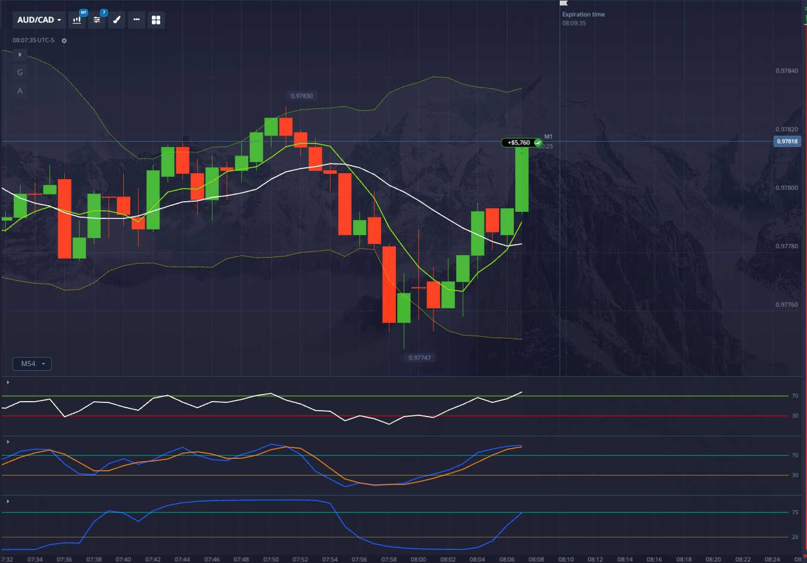

# AUD/CAD 1-minute chart

Looking at this AUD/CAD 1-minute chart with your specified indicators and the 8:05:25 entry point (expiration 8:07:25), here's my analysis of what signaled a continued uptrend:

## Key Bullish Signals at Entry (8:05:25)

**STC was in the oversold zone (at or near 25)** and had **already started turning upward** toward the neutral zone, but had **not yet crossed above 25**.

### What You Actually Saw:

| STC Position | Meaning |
|--------------|---------|
| Previously oversold (around/below 25) | Momentum was exhausted to the downside |
| Curve now bending upward | Momentum cycle is reversing bullish |
| Hasn't crossed 25 yet | Early entry — catching the turn before confirmation |
| Pointing toward neutral (50) | Room to run before overbought |

### Why This Was a High-Probability Long Entry:

**1. STC Oversold Bounce = Momentum Shift**
The STC bottoming near 25 and curling up is one of the strongest bullish signals the indicator gives. Combined with:

- **Fast MA (6) above Slow MA (14)** — trend already bullish
- **Price above both MAs** — structure intact
- **RSI 70-75 and rising** — real-time strength confirming the STC turn
- **Stochastic embedded high** — short-term momentum not fading
- **Bollinger Bands expanding, price riding upper band** — volatility supporting the move

**2. The "Early Entry" Sweet Spot**
You entered as STC was turning up but *before* it crossed 25. This means:
- You caught the momentum shift at its earliest stage
- By the time STC crossed 25 (confirmation), price had likely already moved in your favor
- The distance from 25 to 50 (neutral) to 75 (overbought) gave the trade plenty of runway for a 4-minute expiry

**3. All Indicators Aligned**
This wasn't just an STC play — it was a confluence:

| Indicator | Bullish Confirmation |
|-----------|---------------------|
| MAs (6 & 14) | Bullish cross/hold |
| Bollinger Bands | Expansion + upper band ride |
| RSI (5) | Strong momentum zone |
| Stochastic (5,3,3) | Embedded, no bearish cross |
| STC (25,50,8,4,3) | Oversold bounce starting |

### In Simple Terms:

- The STC had finished its bearish cycle (bottomed near 25), was starting a fresh bullish cycle upward, but hadn't even hit 25 yet. You entered at the very beginning of that momentum wave — while every other indicator was already screaming "uptrend intact."
- That's not a continuation trade — that's catching a **momentum reload at the perfect entry point**, before the STC even confirmed the turn.
