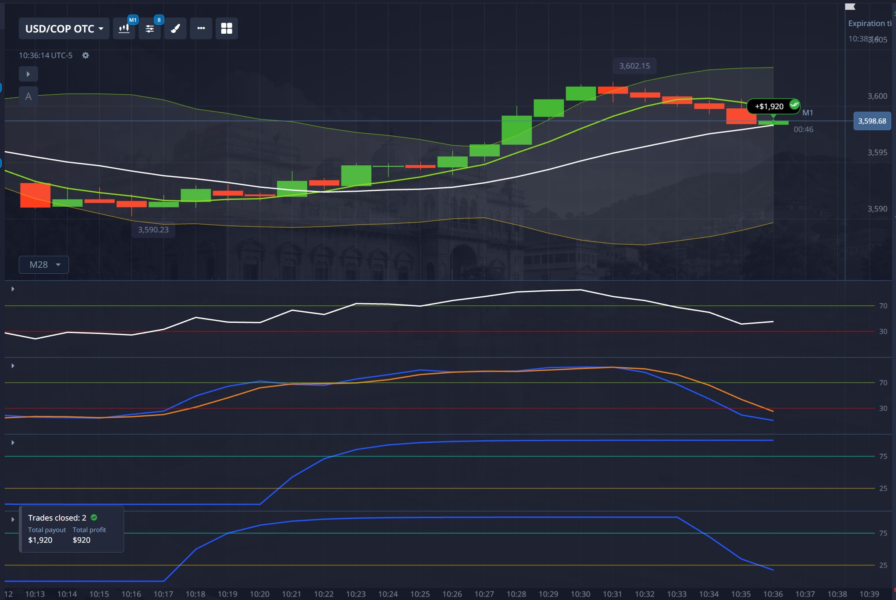

# AUD/CAD 1-minute chart

Looking at this AUD/CAD 1-minute chart with your specified indicators and the 8:05:25 entry point (expiration 8:07:25), here's my analysis of what signaled a continued uptrend:

## Key Bullish Signals at Entry (8:05:25)

**STC was in the oversold zone (at or near 25)** and had **already started turning upward** toward the neutral zone, but had **not yet crossed above 25**.

### What You Actually Saw

| STC Position | Meaning |
|--------------|---------|
| Previously oversold (around/below 25) | Momentum was exhausted to the downside |
| Curve now bending upward | Momentum cycle is reversing bullish |
| Hasn't crossed 25 yet | Early entry — catching the turn before confirmation |
| Pointing toward neutral (50) | Room to run before overbought |

### Why This Was a High-Probability Long Entry

**1. STC Oversold Bounce = Momentum Shift**
The STC bottoming near 25 and curling up is one of the strongest bullish signals the indicator gives. Combined with:

- **Fast MA (6) above Slow MA (14)** — trend already bullish
- **Price above both MAs** — structure intact
- **RSI 70-75 and rising** — real-time strength confirming the STC turn
- **Stochastic embedded high** — short-term momentum not fading
- **Bollinger Bands expanding, price riding upper band** — volatility supporting the move

**2. The "Early Entry" Sweet Spot**
You entered as STC was turning up but *before* it crossed 25. This means:

- You caught the momentum shift at its earliest stage
- By the time STC crossed 25 (confirmation), price had likely already moved in your favor
- The distance from 25 to 50 (neutral) to 75 (overbought) gave the trade plenty of runway for a 4-minute expiry

**3. All Indicators Aligned**
This wasn't just an STC play — it was a confluence:

| Indicator | Bullish Confirmation |
|-----------|---------------------|
| MAs (6 & 14) | Bullish cross/hold |
| Bollinger Bands | Expansion + upper band ride |
| RSI (5) | Strong momentum zone |
| Stochastic (5,3,3) | Embedded, no bearish cross |
| STC (25,50,8,4,3) | Oversold bounce starting |

### In Simple Terms

- The STC had finished its bearish cycle (bottomed near 25), was starting a fresh bullish cycle upward, but hadn't even hit 25 yet. You entered at the very beginning of that momentum wave — while every other indicator was already screaming "uptrend intact."
- That's not a continuation trade — that's catching a **momentum reload at the perfect entry point**, before the STC even confirmed the turn.

# USD/COP

Looking at this USD/COP OTC M28 chart with your **PUT entry at 10:34**, here's the confluence — and notably, this is a **reversal play at the top**, not a continuation like the first chart.

---

## **Price Action Context at 10:34**

| Factor | Observation |
|--------|-------------|
| **Structure** | Price made a clear local high at ~3,602.15 (around 10:30-10:32), then formed a sequence of lower highs with bearish candles |
| **Fast MA (green 6)** | Still above slow MA but **flattening/starting to curl down** — momentum exhaustion |
| **Slow MA (white 14)** | Still rising but lagging; price has broken below the fast MA and is pressing toward the slow MA |
| **Bollinger Bands (2, 20)** | **Expanding** — you noted this. Upper band was tagged at the 3,602 high; now price is falling away from it with widening bands = volatility expansion on the downside, not a squeeze |
| **Price position** | Below fast MA, first red candles after the peak, small-bodied consolidation near the top before the drop |

---

## **Indicator Confluence at 10:34**

### RSI (5)

- **Rolling over from above 70** (or near it) — classic momentum exhaustion signal
- The slope is turning negative; this isn't a pullback in an uptrend, it's a *peak rejection*

### Stochastic (5, 3, 3)

- **Bearish crossover** happening or just completed — %K (blue) crossing below %D (orange)
- Both lines were in overbought territory (>70) and now descending together
- This is **late-cycle momentum reversal**, not early-cycle continuation

### STC (25, 50, 8, 4, 3)

- **At or near the 75 ceiling, starting to turn down** — the Schaff cycle is peaking
- The flat-to-falling curvature at the top signals the bullish cycle is ending
- This is your **trend-commitment filter flipping bearish**

### STCK (12, 25, 5, 3, 3) — *New addition*

- You added this for catching tops/bottoms with faster response
- At 10:34, this likely showed an **earlier bearish crossover** than the standard Stoch, giving you the heads-up before the main Stoch confirmed
- The faster settings (12, 25 vs 5, 3, 3) mean it reacts quicker to micro-structure shifts — perfect for timing reversal entries

---

## **The Core Logic: Why "Reversal Down" at 10:34**

| Element | First Chart (AUD/CAD CALL) | This Chart (USD/COP PUT) |
|--------|---------------------------|--------------------------|
| **Entry type** | Continuation | Reversal |
| **Structure** | V-bottom, higher lows | Double-top / lower highs after peak |
| **MA state** | Fast > Slow, both rising | Fast flattening, price broke below |
| **BB behavior** | Walking upper band | **Expanding after upper tag** = rejection |
| **RSI** | Rising from 30-50 | **Rolling over from >70** |
| **Stoch** | Rising in sync, no crossover | **Bearish crossover from overbought** |
| **STC** | Rising from 25 | **Peaking at 75, turning down** |
| **STCK** | Not critical | **Early bearish signal** |
| **Timing** | First hold above MA after impulse | First break below MA after peak |

---

## **What You Were Reading Here**

> *"A momentum exhaustion play at a confirmed local top, where Bollinger expansion after an upper-band tag signals volatility shift to the downside, oscillators are rolling over from overbought in synchronized bearish crossovers, and the faster STCK gave an early warning."*

The **BB expansion** is key — in the first chart, expansion meant "trend is strong, ride it." Here, expansion *after a peak* means "the move is reversing with force." Same indicator behavior, opposite interpretation because of **location in the cycle**.

---

## **Pattern Distillation So Far**

| Setup | Price Structure | RSI | Stoch | STC | BB | STCK Role |
|-------|----------------|-----|-------|-----|-----|-----------|
| **CALL (AUD/CAD)** | V-bottom + hold above MA | Rising from low | Rising, no cross | Rising from 25 | Walking upper | — |
| **PUT (USD/COP)** | Peak + break below MA | Rolling from >70 | Bearish cross from >70 | Peaking at 75 | Expanding down | Early warning |
